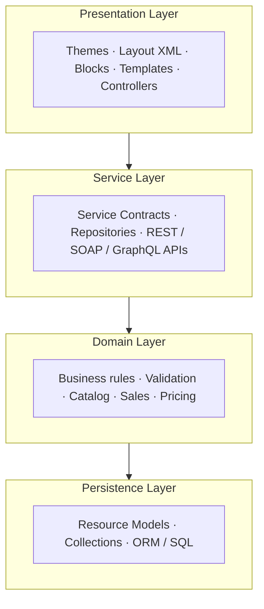

# CH-01: Architecture & Request Lifecycle

[← Back to Roadmap](../README.md)

---

<a id="11-magento-2-overall-architecture-overview"></a>
### [✔] 1.1 Magento 2 overall architecture overview — areas, layers, components

Magento 2 is a modular, layered e-commerce framework built for scalability, customization, and enterprise use. It applies **separation of concerns**, **Dependency Injection (DI)**, **service contracts**, **plugins**, and **observers** so modules stay loosely coupled and extensible.

**Core design principles:**

| Principle | Summary |
| --------- | ------- |
| **Modularity** | Features live in independent modules with explicit dependencies (`module.xml`, `composer.json`) |
| **Separation of concerns** | UI, business rules, and persistence are isolated |
| **Modern patterns** | MVVM-style presentation, DI, service contracts, Front Controller routing |



#### Magento 2 Architecture Layers

Magento organizes the application into **four main layers**:

| Layer | Responsibility | Includes / Examples |
| ----- | -------------- | ------------------- |
| **A. Presentation** | Everything the user interacts with (storefront + admin) | Themes, Layout XML, Blocks, Templates (`.phtml`), CSS/JS, UI Components, Controllers |
| **B. Service** | Bridge between presentation and business logic; stable public APIs | Service contracts (interfaces in `Api/`), repository APIs, REST & SOAP endpoints |
| **C. Domain (Business Logic)** | Core rules — *what* can be done with data, not *how* it is stored | Customer validation, pricing/sales rules, catalog & inventory operations |
| **D. Persistence** | Database read/write and object–row mapping | Resource models, collections, repositories (data access), SQL/ORM |

**Presentation layer request flow:**

1. HTTP request arrives
2. Front Controller (`pub/index.php`) routes to the correct module/controller
3. Controller coordinates services/domain logic
4. Blocks + templates render HTML (or JSON for APIs)
5. Response is returned to the client

> **Interview tip:** Prefer calling **service contracts** from controllers instead of loading models directly — keeps layers clean and upgrades safer.

#### Core Magento Components

| Component | Role |
| --------- | ---- |
| `pub/index.php` | Web entry point — bootstrap + HTTP application |
| `bin/magento` | CLI entry (setup, cache, indexers, cron consumers) |
| **Bootstrap** | Loads autoload, config, object manager |
| **Object Manager / DI** | Resolves dependencies (`di.xml`) |
| **Router / FrontController** | Maps URL → controller action |
| **Modules** | `registration.php`, `module.xml`, `etc/`, code + `view/` |
| **Plugins & Observers** | Extend behavior without core edits |

---

<a id="12-application-areas"></a>
### [✔] 1.2 Application areas — `frontend`, `adminhtml`, `base`, `crontab`, `webapi_rest`, `graphql`

An **area** is a logical execution context. Magento loads only the code required for that context, which keeps requests lean and separates storefront, admin, API, and cron behavior.

| Area code | Common name | Purpose |
| --------- | ----------- | ------- |
| `frontend` | Storefront | Customer-facing shop — themes, layouts, controllers for the storefront |
| `adminhtml` | Admin | Magento Admin panel — backend UI, grids, forms, ACL |
| `base` | Basic | Shared code used on **both** admin and storefront (not a “request area” users hit directly) |
| `crontab` | Cron | Scheduled jobs — configured in `etc/crontab.xml`; bootstrapped via `cron.php` / `\Magento\Framework\App\Cron` |
| `webapi_rest` | Web API REST | REST API requests — `webapi.xml` routes to service contract methods |
| `graphql` | GraphQL | GraphQL API — schema in `schema.graphqls`, resolvers for queries/mutations |
| `webapi_soap` | Web API SOAP | SOAP API endpoints |

**How areas work with modules:**

- Modules declare area-specific config under `etc/<area>/` (e.g. `etc/frontend/routes.xml`, `etc/adminhtml/system.xml`).
- The same module can participate in multiple areas.
- Enabling a module registers its routers and resources into the application routing process for each area it supports.

**Setting the area in code:** `State::setAreaCode('frontend')` (required before certain operations in CLI/custom scripts).

---

<a id="13-request-lifecycle"></a>
### [✔] 1.3 Request lifecycle — `index.php` → Bootstrap → App → FrontController → Router → Controller

| Step | Process |
| ---- | ------- |
| 1 | Request hits web server (Nginx/Apache) — optionally Varnish/CDN |
| 2 | `pub/index.php` loads `Bootstrap` and creates the HTTP application |
| 3 | Application resolves **area** (`frontend`, `adminhtml`, etc.) |
| 4 | **FrontController** dispatches through registered routers |
| 5 | Matching **controller** `execute()` runs |
| 6 | **Service / domain** layers handle business logic |
| 7 | **Persistence** reads/writes via resource models / repositories |
| 8 | Layout, blocks, and templates build the response |
| 9 | HTTP response returned (HTML, JSON, redirect, etc.) |

Middleware applied along the way: configuration load, cache, session, ACL (admin), form keys, etc.

---

<a id="14-router-types"></a>
### [✔] 1.4 Magento 2 Default Routers

Magento 2 contains multiple built-in routers used by the FrontController to process different types of requests.

| Router ID     | Class                                        |
| ------------- | -------------------------------------------- |
| `standard`    | `Magento\Framework\App\Router\Base`          |
| `default`     | `Magento\Framework\App\Router\DefaultRouter` |
| `cms`         | `Magento\Cms\Controller\Router`              |
| `urlrewrite`  | `Magento\UrlRewrite\Controller\Router`       |
| `admin`       | `Magento\Backend\App\Router`                 |
| `webapi_rest` | `Magento\Webapi\Controller\Rest\Router`      |
| `webapi_soap` | `Magento\Webapi\Controller\Soap`             |

---

# Router Purpose

| Router ID     | Purpose                             |
| ------------- | ----------------------------------- |
| `standard`    | Default frontend controller routing |
| `default`     | Handles no-route fallback requests  |
| `cms`         | Resolves CMS pages                  |
| `urlrewrite`  | Handles SEO URL rewrites            |
| `admin`       | Processes Magento Admin routes      |
| `webapi_rest` | Handles REST API requests           |
| `webapi_soap` | Handles SOAP API requests           |

---

# Magento Router Processing Flow

```text id="jlwm5k"
Request
   ↓
FrontController
   ↓
RouterList
   ↓
Router Match
   ↓
Controller Action
   ↓
Response
```

---

# Router Configuration Locations

| Area      | File                       |
| --------- | -------------------------- |
| Frontend  | `etc/frontend/routes.xml`  |
| Adminhtml | `etc/adminhtml/routes.xml` |
| Web API   | `etc/webapi.xml`           |

```
```
Class : Magento\Framework\App\RouterList
---

<a id="15-controller-anatomy"></a>
### [✔] 1.5 Controller anatomy — `execute()`, `ResultFactory`, redirect vs page vs JSON response

In Magento 2, controllers handle incoming HTTP requests and return responses. Controllers are part of the MVC (Model-View-Controller) architecture and are executed after routing is completed.

Controllers are mapped through `routes.xml` and located inside the module's `Controller` directory.

---

# Controller Flow

```text id="mwd4ke"
Request
   ↓
Router
   ↓
Controller Action
   ↓
Business Logic
   ↓
Response Result
```

---

# Controller Directory Structure

## Frontend Controller

```text id="rbj5pl"
app/code/Vendor/Module/Controller/Index/View.php
```

## Admin Controller

```text id="7xvd7t"
app/code/Vendor/Module/Controller/Adminhtml/Product/Save.php
```

---

# Basic Controller Example

```php id="3h8sr8"
<?php

declare(strict_types=1);

namespace Vendor\Module\Controller\Index;

use Magento\Framework\App\Action\HttpGetActionInterface;
use Magento\Framework\Controller\ResultFactory;

class View implements HttpGetActionInterface
{
    public function __construct(
        private readonly ResultFactory $resultFactory
    ) {
    }

    public function execute()
    {
        return $this->resultFactory->create(ResultFactory::TYPE_PAGE);
    }
}
```

---

# Main Controller Components

| Component        | Purpose                   |
| ---------------- | ------------------------- |
| Router           | Matches request URL       |
| Controller Class | Handles request execution |
| `execute()`      | Main controller method    |
| Request Object   | Accesses request data     |
| Result Object    | Returns response          |
| ResultFactory    | Creates response types    |

---

# Controller Types

| Type              | Interface                   |
| ----------------- | --------------------------- |
| GET Controller    | `HttpGetActionInterface`    |
| POST Controller   | `HttpPostActionInterface`   |
| PUT Controller    | `HttpPutActionInterface`    |
| DELETE Controller | `HttpDeleteActionInterface` |

---

# Common Result Types

| Result Type     | Purpose              |
| --------------- | -------------------- |
| `TYPE_PAGE`     | Render HTML page     |
| `TYPE_JSON`     | Return JSON response |
| `TYPE_RAW`      | Return raw content   |
| `TYPE_REDIRECT` | Redirect request     |
| `TYPE_FORWARD`  | Forward internally   |

---

# Request URL Mapping

Magento maps URLs using this structure:

```text id="vjlwm3"
frontName/controller/action
```

Example:

```text id="md3fgx"
https://example.com/blog/post/view
```

| URL Part | Meaning           |
| -------- | ----------------- |
| `blog`   | Front name        |
| `post`   | Controller folder |
| `view`   | Action class      |

---

# Route Configuration Example

```xml id="1nkmsp"
<router id="standard">
    <route id="blog" frontName="blog">
        <module name="Vendor_Module"/>
    </route>
</router>
```

---

# Controller Responsibilities

| Responsibility  | Description                         |
| --------------- | ----------------------------------- |
| Handle Request  | Receive HTTP request                |
| Validate Data   | Validate input parameters           |
| Execute Logic   | Call models/services                |
| Return Response | Generate page, JSON, redirect, etc. |

---

# Best Practices

| Practice                 | Description                            |
| ------------------------ | -------------------------------------- |
| Keep Controllers Thin    | Move business logic to services/models |
| Use Dependency Injection | Avoid Object Manager directly          |
| Use ResultFactory        | Return proper response objects         |
| Validate Requests        | Sanitize and validate input            |
| Use HTTP Interfaces      | Define allowed request methods         |

- Admin actions often extend `Action` and check `_isAllowed()` against ACL resources.

---

<a id="16-action-url-structure"></a>
### [✔] 1.6 Action URL structure — `frontName/controller/action`

```
https://example.com/{frontName}/{controller}/{action}
```

| Part | Defined in | Example |
| ---- | ---------- | ------- |
| `frontName` | `routes.xml` `<route id="..." frontName="catalog">` | `catalog` |
| `controller` | Folder `Controller/Product/` | `product` |
| `action` | Method `viewAction` → `view` | `view` |

Full action name: `catalog_product_view` (route + controller + action).

---

<a id="17-magento-directory-structure"></a>
### [✔] 1.7 Magento directory structure — `app/`, `vendor/`, `pub/`, `var/`, `generated/`

Magento 2 uses a modular directory structure that separates application code, generated files, public assets, and runtime data.

| Directory                | Purpose                                                  |
| ------------------------ | -------------------------------------------------------- |
| `app/`                   | Custom application code and configuration                |
| `app/code/`              | Custom modules                                           |
| `app/design/`            | Themes and design files                                  |
| `app/etc/`               | Global configuration files (`env.php`, `config.php`)     |
| `vendor/`                | Composer-installed Magento core and third-party packages |
| `pub/`                   | Public web root directory                                |
| `pub/index.php`          | Main HTTP entry point                                    |
| `pub/static/`            | Generated static view files                              |
| `pub/media/`             | Uploaded media files                                     |
| `var/`                   | Runtime generated data                                   |
| `var/cache/`             | Application cache                                        |
| `var/page_cache/`        | Full page cache data                                     |
| `var/log/`               | Log files                                                |
| `var/session/`           | Session storage                                          |
| `var/view_preprocessed/` | Preprocessed frontend assets                             |
| `generated/`             | Generated dependency injection classes                   |
| `generated/code/`        | Generated factories, proxies, interceptors               |
| `generated/metadata/`    | Generated DI metadata                                    |
| `setup/`                 | Setup and upgrade application files                      |
| `bin/magento`            | Magento CLI entry point                                  |
| `dev/`                   | Development tools and scripts                            |
| `lib/`                   | Internal Magento framework libraries                     |
| `update/`                | Web setup updater files                                  |

---

# Important Configuration Files

| File                 | Purpose                             |
| -------------------- | ----------------------------------- |
| `app/etc/env.php`    | Environment-specific configuration  |
| `app/etc/config.php` | Module and deployment configuration |
| `composer.json`      | Composer dependency configuration   |
| `registration.php`   | Module/theme registration           |
| `etc/module.xml`     | Module declaration                  |

---

# Directory Categories

| Category            | Directories          |
| ------------------- | -------------------- |
| Application Code    | `app/`, `vendor/`    |
| Public Web Files    | `pub/`               |
| Generated Files     | `generated/`, `var/` |
| Development Tools   | `dev/`, `bin/`       |
| Configuration       | `app/etc/`           |
| Framework Libraries | `lib/`               |

---

<a id="18-module-file-structure"></a>
### [✔] 1.8 Module file structure — `registration.php`, `module.xml`, `etc/`, `Block/`, `Controller/`, `Model/`, `view/`

```
Vendor/Module/
├── registration.php          # ComponentRegistrar::register(MODULE, ...)
├── composer.json
├── etc/
│   ├── module.xml            # Name, version, <sequence> dependencies
│   ├── di.xml
│   └── [area]/               # Area-specific config
├── Api/                      # Service contracts (interfaces)
├── Model/                    # Business logic + resource models
├── Controller/
├── Block/
├── Observer/
├── Plugin/
├── Setup/ or etc/db_schema.xml
└── view/
    ├── frontend/
    └── adminhtml/
        ├── layout/
        ├── templates/
        └── web/
```

---
