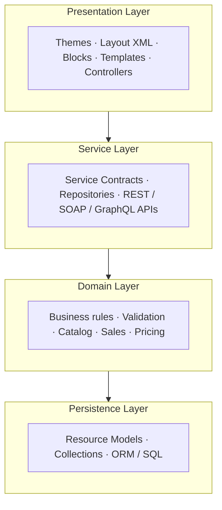

# CH-01: Architecture & Request Lifecycle

[← Back to Roadmap](../README.md)

---

<a id="11-magento-2-overall-architecture-overview"></a>
### 1.1 Magento 2 overall architecture overview — areas, layers, components

- [ ] **1.1** Magento 2 overall architecture overview — areas, layers, components

Magento 2 is a modular, layered e-commerce framework built for scalability, customization, and enterprise use. It applies **separation of concerns**, **Dependency Injection (DI)**, **service contracts**, **plugins**, and **observers** so modules stay loosely coupled and extensible.

**High-level building blocks** ([Webkul — Magento 2 Architecture](https://webkul.com/blog/magento-2-architecture/)):

| Component | Description |
| --------- | ----------- |
| **Core product code** | Base functionality shipped with Magento / Adobe Commerce |
| **Optional modules** | Extensions that add or override behavior without editing core |

**Core design principles:**

| Principle | Summary |
| --------- | ------- |
| **Modularity** | Features live in independent modules with explicit dependencies (`module.xml`, `composer.json`) |
| **Separation of concerns** | UI, business rules, and persistence are isolated |
| **Modern patterns** | MVVM-style presentation, DI, service contracts, Front Controller routing |



#### Magento 2 Architecture Layers

Magento organizes the application into **four main layers** ([Webkul — Magento 2 Architecture](https://webkul.com/blog/magento-2-architecture/)):

| Layer | Responsibility | Includes / Examples |
| ----- | -------------- | ------------------- |
| **A. Presentation** | Everything the user interacts with (storefront + admin) | Themes, Layout XML, Blocks, Templates (`.phtml`), CSS/JS, UI Components, Controllers |
| **B. Service** | Bridge between presentation and business logic; stable public APIs | Service contracts (interfaces in `Api/`), repository APIs, REST & SOAP endpoints |
| **C. Domain (Business Logic)** | Core rules — *what* can be done with data, not *how* it is stored | Customer validation, pricing/sales rules, catalog & inventory operations |
| **D. Persistence** | Database read/write and object–row mapping | Resource models, collections, repositories (data access), SQL/ORM |

**Presentation layer request flow:**

1. HTTP request arrives
2. Front Controller (`pub/index.php`) routes to the correct module/controller
3. Controller coordinates services/domain logic
4. Blocks + templates render HTML (or JSON for APIs)
5. Response is returned to the client

> **Interview tip:** Prefer calling **service contracts** from controllers instead of loading models directly — keeps layers clean and upgrades safer.

#### Core Magento Components

| Component | Role |
| --------- | ---- |
| `pub/index.php` | Web entry point — bootstrap + HTTP application |
| `bin/magento` | CLI entry (setup, cache, indexers, cron consumers) |
| **Bootstrap** | Loads autoload, config, object manager |
| **Object Manager / DI** | Resolves dependencies (`di.xml`) |
| **Router / FrontController** | Maps URL → controller action |
| **Modules** | `registration.php`, `module.xml`, `etc/`, code + `view/` |
| **Plugins & Observers** | Extend behavior without core edits |

---

<a id="12-application-areas"></a>
### 1.2 Application areas — `frontend`, `adminhtml`, `crontab`, `webapi_rest`, `graphql`, `doc`

- [ ] **1.2** Application areas — `frontend`, `adminhtml`, `crontab`, `webapi_rest`, `graphql`, `doc`

An **area** is a logical execution context. Magento loads only the code required for that context, which keeps requests lean and separates storefront, admin, API, and cron behavior ([Webkul — Magento 2 Area codes](https://webkul.com/blog/magento-2-area-codes/)).

| Area code | Common name | Purpose |
| --------- | ----------- | ------- |
| `frontend` | Storefront | Customer-facing shop — themes, layouts, controllers for the storefront |
| `adminhtml` | Admin | Magento Admin panel — backend UI, grids, forms, ACL |
| `base` | Basic | Shared code used on **both** admin and storefront (not a “request area” users hit directly) |
| `crontab` | Cron | Scheduled jobs — configured in `etc/crontab.xml`; bootstrapped via `cron.php` / `\Magento\Framework\App\Cron` |
| `webapi_rest` | Web API REST | REST API requests — `webapi.xml` routes to service contract methods |
| `graphql` | GraphQL | GraphQL API — schema in `schema.graphqls`, resolvers for queries/mutations |
| `webapi_soap` | Web API SOAP | SOAP API endpoints |
| `doc` | API Docs | Web API documentation UI (Swagger) in developer setups |

**How areas work with modules:**

- Modules declare area-specific config under `etc/<area>/` (e.g. `etc/frontend/routes.xml`, `etc/adminhtml/system.xml`).
- The same module can participate in multiple areas (e.g. RMA in both `frontend` and `adminhtml`).
- Enabling a module registers its routers and resources into the application routing process for each area it supports.

**Setting the area in code:** `State::setAreaCode('frontend')` (required before certain operations in CLI/custom scripts).

---

<a id="13-request-lifecycle"></a>
### 1.3 Request lifecycle — `index.php` → Bootstrap → App → FrontController → Router → Controller

- [ ] **1.3** Request lifecycle — `index.php` → Bootstrap → App → FrontController → Router → Controller

| Step | Process |
| ---- | ------- |
| 1 | Request hits web server (Nginx/Apache) — optionally Varnish/CDN |
| 2 | `pub/index.php` loads `Bootstrap` and creates the HTTP application |
| 3 | Application resolves **area** (`frontend`, `adminhtml`, etc.) |
| 4 | **FrontController** dispatches through registered routers |
| 5 | Matching **controller** `execute()` runs |
| 6 | **Service / domain** layers handle business logic |
| 7 | **Persistence** reads/writes via resource models / repositories |
| 8 | Layout, blocks, and templates build the response |
| 9 | HTTP response returned (HTML, JSON, redirect, etc.) |

Middleware applied along the way: configuration load, cache, session, ACL (admin), form keys, etc.

---

<a id="14-router-types"></a>
### 1.4 Router types — standard, admin, CMS, default (404)

- [ ] **1.4** Router types — standard, admin, CMS, default (404)

| Router | Area | Matches |
| ------ | ---- | ------- |
| **Standard** | `frontend` | `frontName/controller/action` module routes |
| **Admin** | `adminhtml` | Admin URLs (`admin` frontName, ACL-protected) |
| **CMS** | `frontend` | CMS pages and hierarchy |
| **Default** | Any | No match → 404 / noroute handler |

Routers are declared in `routes.xml` per area; sort order determines evaluation sequence.

---

<a id="15-controller-anatomy"></a>
### 1.5 Controller anatomy — `execute()`, `ResultFactory`, redirect vs page vs JSON response

- [ ] **1.5** Controller anatomy — `execute()`, `ResultFactory`, redirect vs page vs JSON response

- Controllers implement `ActionInterface` with `execute()` returning a `ResultInterface`.
- **`ResultFactory`** builds:
  - **Page** — layout + blocks (HTML page)
  - **Redirect** — `resultRedirectFactory`
  - **JSON** — API/AJAX responses
  - **Forward** — internal forward to another action
- Admin actions often extend `Action` and check `_isAllowed()` against ACL resources.

---

<a id="16-action-url-structure"></a>
### 1.6 Action URL structure — `frontName/controller/action`

- [ ] **1.6** Action URL structure — `frontName/controller/action`

```
https://example.com/{frontName}/{controller}/{action}
```

| Part | Defined in | Example |
| ---- | ---------- | ------- |
| `frontName` | `routes.xml` `<route id="..." frontName="catalog">` | `catalog` |
| `controller` | Folder `Controller/Product/` | `product` |
| `action` | Method `viewAction` → `view` | `view` |

Full action name: `catalog_product_view` (route + controller + action).

---

<a id="17-magento-directory-structure"></a>
### 1.7 Magento directory structure — `app/`, `vendor/`, `pub/`, `var/`, `generated/`

- [ ] **1.7** Magento directory structure — `app/`, `vendor/`, `pub/`, `var/`, `generated/`

| Directory | Purpose |
| --------- | ------- |
| `app/` | Custom code — `code/`, `design/`, `etc/config.php` |
| `vendor/` | Composer packages (core + third-party modules) |
| `pub/` | Web root — `index.php`, `static/`, `media/` |
| `var/` | Logs, cache, sessions, import/export, tmp |
| `generated/` | Compiled code — interceptors, factories, proxies |
| `setup/` | Installer / upgrade wizard |
| `bin/magento` | CLI entry point |

---

<a id="18-module-file-structure"></a>
### 1.8 Module file structure — `registration.php`, `module.xml`, `etc/`, `Block/`, `Controller/`, `Model/`, `view/`

- [ ] **1.8** Module file structure — `registration.php`, `module.xml`, `etc/`, `Block/`, `Controller/`, `Model/`, `view/`

```
Vendor/Module/
├── registration.php          # ComponentRegistrar::register(MODULE, ...)
├── composer.json
├── etc/
│   ├── module.xml            # Name, version, <sequence> dependencies
│   ├── di.xml
│   └── [area]/               # Area-specific config
├── Api/                      # Service contracts (interfaces)
├── Model/                    # Business logic + resource models
├── Controller/
├── Block/
├── Observer/
├── Plugin/
├── Setup/ or etc/db_schema.xml
└── view/
    ├── frontend/
    └── adminhtml/
        ├── layout/
        ├── templates/
        └── web/
```

---

## References

- [Magento 2 Architecture — Webkul](https://webkul.com/blog/magento-2-architecture/)
- [Magento 2 Area codes — Webkul](https://webkul.com/blog/magento-2-area-codes/)

---
